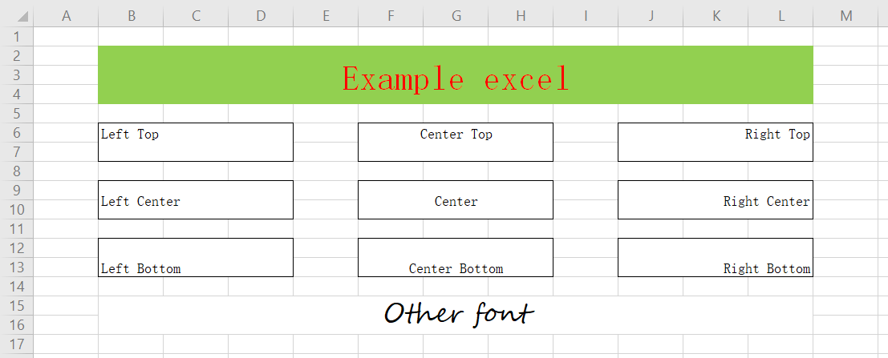
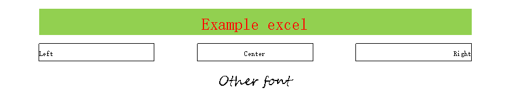

# Excel Camera

简体中文 | [English](README_EN.md)

将 Excel 生成为图片

## 原理

使用 Apache Poi 读取并解析 Excel 文件，利用 `BufferedImage` 绘制单元格

## 预览





## 使用

### 代码

```java
import cn.ryoii.ExcelCamera;
import cn.ryoii.ExcelCameraConfiguration;
import org.junit.Test;

import java.io.File;

public class ExampleTest {

    @Test
    public void example() {
        File file = new File("excel/example.xlsx");
        ExcelCameraConfiguration configuration = new ExcelCameraConfiguration(file);
        configuration
                .rowTo(12).colTo(13)
                .rowZoom(1.1).colZoom(1.1)
                .sheetName("example sheet");
        ExcelCamera excelCamera = new ExcelCamera(configuration);

        try {
            excelCamera.asImageFile("pic/example.png");
        } catch (Exception e) {
            e.printStackTrace();
        }
    }
}
```

## 支持程度（TODOLIST）

### 文件类型

+ [X] `.xls`
+ [X] `.xlsx`

### 文件内容

+ [X] 指定生成范围
+ [X] 生成缩放
+ [X] 单元格自定义宽、高
+ [X] 指定工作页
+ [ ] 多工作页

### 内容类型

+ [X] 文本、数字
+ [ ] 日期
+ [ ] 公式
+ [ ] 图片

### 文字

+ [X] 字体大小
+ [X] 字体颜色
+ [X] 文本水平居中
+ [X] 文本垂直居中
+ [ ] 文本换行
+ [ ] 自动调整单元格宽度

### 单元格样式

+ [X] 文本前景色
+ [X] 单元格背景色
+ [ ] 单元格纹理
+ [X] 合并单元格
+ [X] 单元格边框
+ [ ] 边框样式
