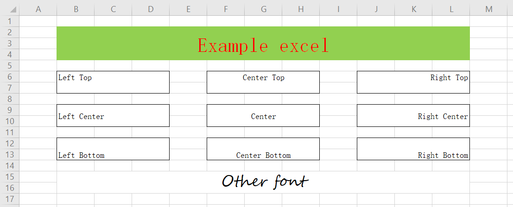
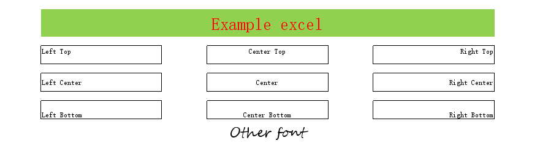

# Excel Camera

[简体中文](README.md) | English

Generate the picture of excel

## Introduction

Read and parse the Excel file with Apache Poi，and draw the picture with `BufferedImage`.

## Snapshot





## Usage

### Code

```java
import cn.ryoii.ExcelCamera;
import cn.ryoii.ExcelCameraConfiguration;
import org.junit.Test;

import java.io.File;

public class ExampleTest {

    @Test
    public void example() {
        File file = new File("excel/example.xlsx");
        ExcelCameraConfiguration configuration = new ExcelCameraConfiguration(file);
        configuration
                .rowTo(12).colTo(13)
                .rowZoom(1.1).colZoom(1.1)
                .sheetName("example sheet");
        ExcelCamera excelCamera = new ExcelCamera(configuration);

        try {
            excelCamera.asImageFile("pic/example.png");
        } catch (Exception e) {
            e.printStackTrace();
        }
    }
}
```

## TODOLIST

### File type

+ [X] `.xls`
+ [X] `.xlsx`

### Content

+ [X] 
+ [X] Zoom
+ [X] Customized cell width and height
+ [X] Sheet
+ [ ] Multi sheets

### Content type

+ [X] Text、Numeric
+ [ ] Date
+ [ ] Formula
+ [ ] Picture

### Font

+ [X] Font size
+ [X] Font Color
+ [X] Text horizontal align
+ [ ] Text vertical align
+ [ ] Line breaker and text wrap
+ [ ] auto size

### Cell style

+ [X] Foreground color
+ [X] Background color
+ [ ] Texture
+ [X] Cell merge
+ [X] Cell border
+ [ ] Cell border style
